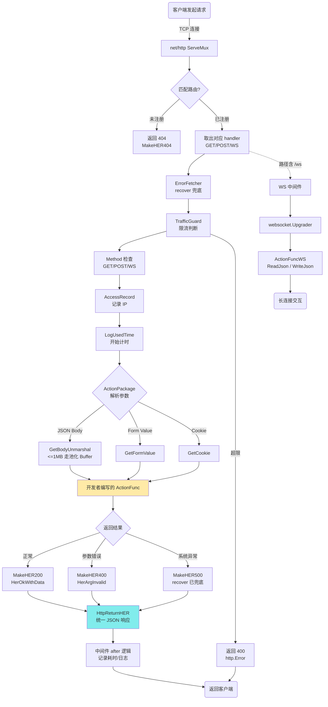

# ccgo

一个极简、易扩展的 golang HTTP 微框架

---

## 1. 项目简介

快速搭建 RESTful 与 WebSocket 接口，并内置常用中间件：

- **路由组**（ActionGroup）  
- **异常恢复**（ErrorFetcher）  
- **流量守卫**（TrafficGuard）  
- **访问日志 & 耗时统计**（AccessRecord / LogUsedTime）  
- **Cookie、CORS 支持预留**（EnableCookie / EnableAllowOrigin）

---

## 2. 目录结构

```
─cc
    ├─cli
    ├─comn
    │  ├─cod
    │  ├─config
    │  ├─convert
    │  ├─err
    │  ├─math
    │  ├─str
    │  └─test
    ├─config
    ├─err
    ├─err_code
    └─middleware
        ├─helper
        └─util
```

### 2.1 项目逻辑



---

## 3. 快速开始

### 3.1 获取源码

```bash
git clone https://github.com/cyf-gh/ccgo.git
cd ccgo
```

### 3.2 运行

```bash
go mod tidy        # 拉取依赖
go run ./main.go   # 默认监听 :8080
```

### 3.3 测试

- **Echo 接口**
  ```bash
  curl 'http://localhost:8080/api/echo?a=hello-ccgo'
  # 返回 {"errCod":"0","desc":"ok","data":"hello-ccgo"}
  ```

- **查看日志**（终端输出示例）
  ```
  2024/05/01 15:04:05 [INFO] middleware loading...
  2024/05/01 15:04:05 [INFO] middleware finished loading
  2024/05/01 15:04:07 [LOG] [Access] 200 - 127.0.0.1:53012 GET /api/echo 0.42 ms
  ```

---

## 4. 如何添加新接口

1. 在 `internal` 下新建业务包，例如 `internal/article`。
2. 在 `init()` 里注册路由组：
   ```go
   func init() {
       cc.AddActionGroup("/api/article", func(a cc.ActionGroup) error {
           a.GET("/list", listArticles)
           a.POST("/create", createArticle)
           return nil
       })
   }
   ```
3. **无需改动 `main.go`**，重启服务立即生效。

---

## 5. 中间件列表

| 名称            | 功能说明                                   | 是否默认启用 |
|-----------------|--------------------------------------------|--------------|
| LogUsedTime     | 记录每次请求耗时                           | ✅           |
| ErrorFetcher    | 捕获 panic，返回统一 JSON 错误             | ✅           |
| TrafficGuard    | 基于 IP + Path 的 QPS 限流，默认 30 req/s  | ✅           |
| AccessRecord    | 访问日志（IP、方法、状态码、耗时）         | ✅           |
| EnableCookie    | 自动解析/设置 Cookie                       | ❌           |
| EnableAllowOrigin| 支持跨域 CORS                              | ❌           |

启用/关闭：编辑 `InitMiddlewares()` 注释或取消相应 `mw.Register()` 即可。

---

## 6. 配置参数

| 环境变量        | 默认值 | 说明                     |
|-----------------|--------|--------------------------|
| `PORT`          | 8080   | 监听端口                 |
| `LOG_LEVEL`     | info   | glg 日志级别             |
| `TG_DEFAULT_QPS`| 30     | 全局默认 QPS 上限        |
| `CC_MAX_ROUTES` | `256` | 路由映射初始容量。若预期路由数 > 256，可增大以减少 re-hash。 |
| `GOGC`          | `100` | Go GC 目标百分比；提高至 `200` 可降低 CPU 占用。     |
| `GOMAXPROCS`    | CPU核数 | 限制 Go 运行时使用的核心数，可手动覆盖。                |


```bash
CC_MAX_ROUTES=1024 GOGC=200 go run ./main.go
```
---

## 7. 构建 & 部署

```bash
# 编译可执行文件
go build -o bin/ccgo .

# Docker（可选）
docker build -t ccgo:latest .
docker run -p 8080:8080 ccgo:latest
```

---

## 8. 贡献指南

1. Fork 本仓库  
2. 新功能请放在 `internal/<feature>` 目录  
3. 提交 PR 前确保 `go test ./...` 通过  

---

## 9. License

MIT © 2024 cyf-gh